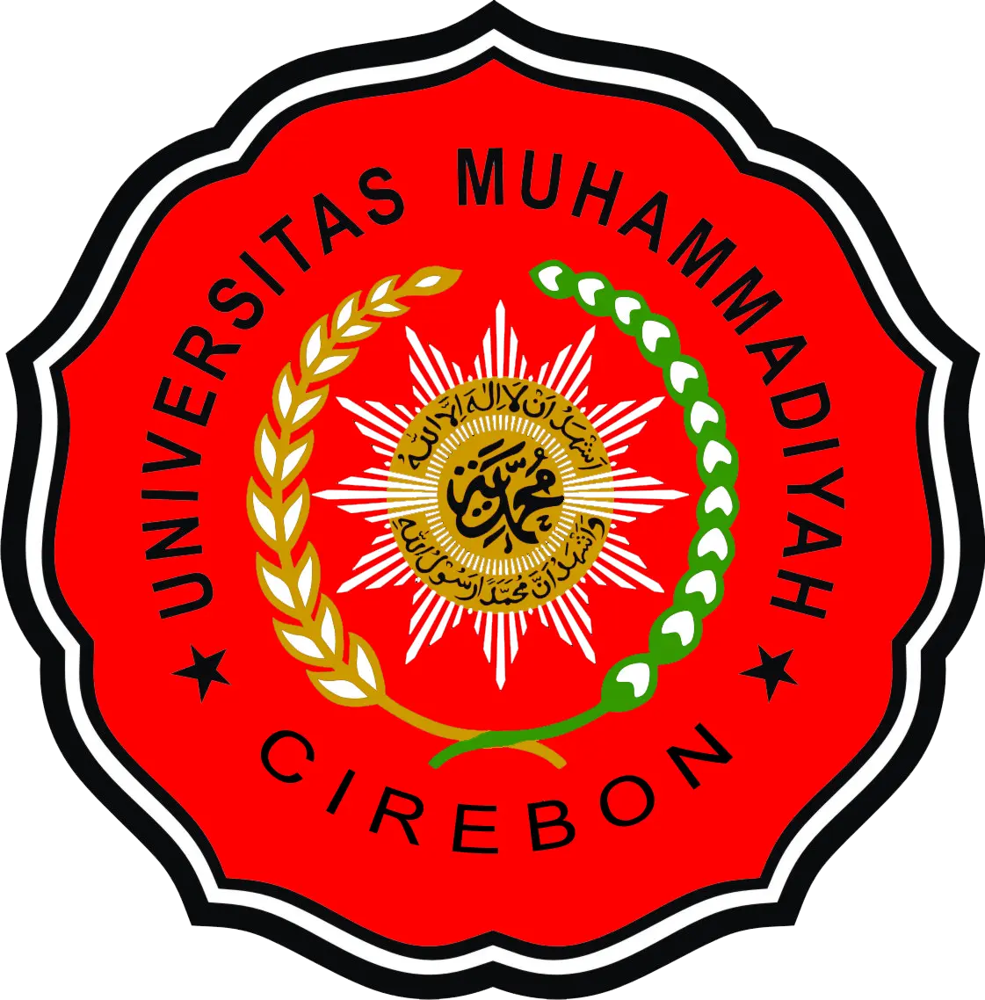

<div align="center">
  
  <h1>🚀 Teknik Informatika — Universitas Muhammadiyah Cirebon</h1>
  <p><strong>Karya Kompetisi Web Design 2026</strong></p>
  <p>Website Company Profile modern, interaktif, dan performa tinggi yang dibangun dengan Next.js App Router, GSAP, dan Tailwind CSS.</p>
  <p>Kami dari Tim H2-FKOM-UNIVERSITAS-KUNINGAN </p>
  <p>Tim Pengembang/Developer : Hersya Yudina & Haqil Abdillah </p>
</div>

---

## ✨ Ikhtisar Proyek (Project Overview)

Proyek ini merupakan hasil dedikasi untuk **Lomba Web Design**, berfokus pada pengalaman pengguna (UX) tingkat tinggi, animasi mikro (*micro-interactions*) yang mulus, dan performa yang sangat ringan. Dirancang khusus untuk mempresentasikan Program Studi Teknik Informatika Universitas Muhammadiyah Cirebon sebagai institusi yang *modern, inovatif, dan berstandar global*.

Pendekatan desain menggunakan estetika **Dark Mode Premium** dengan tipografi eksklusif (PP Mori), aksen warna *Merah UMC* (`#DF1A22`), dan komposisi tata letak *Kinetic Editorial* ala 21st.dev.

---

## 🛠️ Teknologi & Stack (Tech Stack)

Website ini dikembangkan menggunakan teknologi front-end modern terbaik di kelasnya:
- **Framework**: [Next.js 14/15](https://nextjs.org/) (App Router)
- **Styling**: [Tailwind CSS](https://tailwindcss.com/)
- **Animasi Core**: [GSAP (GreenSock)](https://gsap.com/) & ScrollTrigger
- **Animasi Mikro & Drawer**: [Framer Motion](https://www.framer.com/motion/)
- **Smooth Scrolling**: [Lenis](https://lenis.studiofreight.com/)
- **Ikonografi**: [Lucide React](https://lucide.dev/)
- **Tipografi**: Custom Font PP Mori (Self-hosted & Preloaded)

---

## 🌟 Fitur Unggulan (Key Features)

### 1. 🌐 Dukungan Dua Bahasa (Seamless Bilingual ID/EN)
Sistem lokalisasi pintar yang dibangun menggunakan **React Context API**. Pengguna dapat mengganti bahasa (Indonesia/Inggris) secara instan tanpa perlu memuat ulang halaman (*zero page reload*). Terintegrasi ke seluruh elemen mulai dari Navbar, Teks Hero, Animasi GSAP, hingga jawaban dari Chatbot.

### 2. 🎬 Animasi Berbasis Scroll Tingkat Lanjut (Advanced Scroll Animations)
Menggunakan algoritma GSAP *ScrollTrigger* yang dioptimasi untuk performa (GPU-Accelerated dengan `will-change-transform`):
- **Horizontal Scroll Section (Visi & Misi)**: Mengubah *scroll* vertikal menjadi horizontal (*pinning*) di layar Desktop untuk memberikan gaya presentasi sinematik layaknya Apple/Stripe.
- **Teks Interaktif (Quotes)**: Animasi pembagian karakter teks (*character-splitting*) dan interaksi *hover* yang merespons pointer mouse.
- **Seamless Infinite Reel (Testimoni)**: Sistem pita berjalan otomatis (*marquee*) yang sangat halus, *pause on hover*, dan responsif di berbagai perangkat.
- **Galeri 3D Coverflow**: Galeri aktivitas interaktif yang memusatkan pandangan pada foto utama sambil memberikan efek kedalaman (*depth*).

### 3. ⚡ Ultra-Light Performance & Smooth Scroll
Mengintegrasikan **Lenis Smooth Scroll** untuk sensasi *scrolling* yang lebih organik dan cair layaknya *native application*, ditambah pengelolaan performa animasi agar tidak menguras CPU (murni dirender melalui GPU).

### 4. 🤖 Asisten Virtual Cerdas (Interactive Chatbot)
Dilengkapi dengan fitur *chatbot* interaktif melayang (*floating widget*) yang memiliki simulasi ketikan cerdas (*typing feedback*), *smart suggestion chips*, dan tentu saja... ia mampu beralih bahasa seketika!

### 5. 📱 Sensibilitas Responsif Menyeluruh (Pixel-Perfect Responsive)
Mulai dari ukuran layar *smartphone* terkecil hingga monitor *ultra-wide* (4K), tata letak website beradaptasi secara dinamis menggunakan *CSS Grid/Flexbox* dan fungsi perbandingan dinamis `clamp()`.

---

## 📋 Catatan Khusus untuk Dewan Juri (For The Judges)

Website ini tidak hanya mengejar tampilan visual yang cantik, tetapi juga direkayasa untuk memenuhi standar emas pengembangan web:

1. **Perhatian Terhadap Detail (Attention to Detail)**: 
   Setiap transisi, jeda durasi animasi, kurva *easing* (`power3.out`, `power4.out`), dan penggunaan efek *blur/glow* latar belakang dikalibrasi secara khusus.
2. **Kualitas Kode (Clean Code & Architecture)**:
   Kode disusun secara modular dalam *Components* (seperti `Navbar`, `HeroSection`, `Footer`). Logika dipisahkan (seperti `LanguageContext.tsx`) sehingga *maintainability* sangat tinggi.
3. **Pengelolaan State & Memori (Memory Management)**:
   Penggunaan *hook* animasi yang tepat (`useGSAP` dari `@gsap/react`) dengan fitur `scope` memastikan tidak ada kebocoran memori (*memory leak*) ketika navigasi berubah atau ada pembaruan *state* di React 18 Strict Mode.
4. **Desain UI/UX (User Interface & Experience)**:
   Menerapkan *contrast ratio* yang memadai di atas *background* hitam pekat (`#111111`) dengan warna aksen primer `#DF1A22` (merah) yang merepresentasikan identitas kuat institusi.

---

## 💻 Panduan Instalasi (Installation & Local Setup)

Ikuti langkah-langkah di bawah ini untuk menjalankan *project* ini secara lokal di komputer Anda:

```bash
# 1. Clone repositori ini
git clone https://github.com/HersyaDev11/H2-FKOM-UNIKU-HIMASANTIKA.git

# 2. Masuk ke direktori proyek
cd H2-FKOM-UNIKU-HIMASANTIKA

# 3. Instal semua dependensi
npm install
# atau menggunakan yarn/pnpm:
# yarn install
# pnpm install

# 4. Jalankan server pengembangan (development server)
npm run dev
```

Buka [http://localhost:3000](http://localhost:3000) di browser Anda untuk melihat hasilnya.

---

> *"Design is not just what it looks like and feels like. Design is how it works."* – Steve Jobs

Dibuat dengan ❤️ untuk **Lomba Web Design HIMASANTIKA**.
